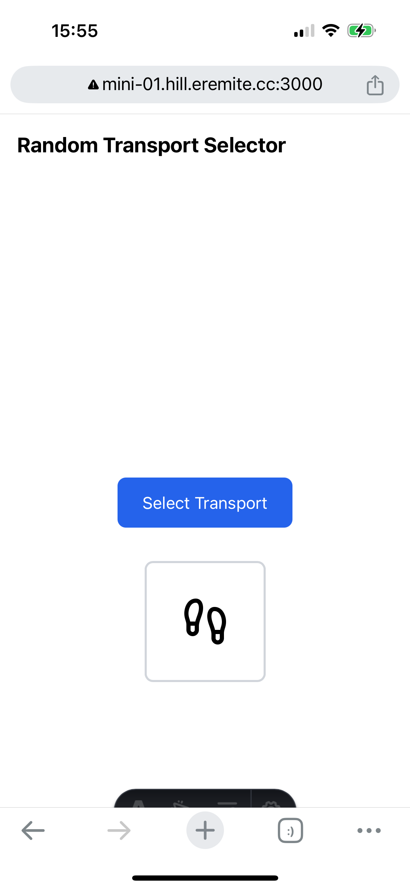

# Worldtravel Game Transportation Random Generator



## How to run

On the docker host:

```bash
cd docker-server-env/
git clone git@github.com:ascheucher/worldtravel-game.git
cd worldtravel-game/
./build.sh

docker run \
  -d \
  --restart unless-stopped \
  --name worldtravel-game \
  --network internal-docker-net \
  -p 4321:4321 \
  worldtravel-game
```

nginx config section:

```nginx
    ############################################
    #     worldtravel-game section

    upstream worldtravel-game {
        server worldtravel-game:4321;
    }
    server {
        listen 80;
        server_name worldtravel-game.hill.eremite.cc;
        return 301 https://$server_name$request_uri;
    }
    server {
        listen 443 ssl;
        http2  on;
        server_name worldtravel-game.hill.eremite.cc;

        ssl_certificate       /etc/letsencrypt/live/worldtravel-game.hill.eremite.cc/fullchain.pem;
        ssl_certificate_key   /etc/letsencrypt/live/worldtravel-game.hill.eremite.cc/privkey.pem;
        ssl_protocols         SSLv3 TLSv1 TLSv1.1 TLSv1.2;
        ssl_ciphers           HIGH:!aNULL:!MD5;
        ssl_session_cache     shared:SSL:2m;
        location / {
            proxy_pass https://worldtravel-game/;
        }
    }
```

Finally, add the domain to the **root's** *~/dockerized-certbot/domains-env* file and create ths TLS certificates.
