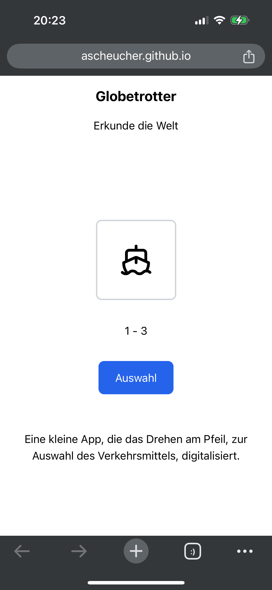

# Globetrotter - Transportation Random Generator

## Hosted

Hosted with GitHub pages at [https://ascheucher.github.io/globetrotter/](https://ascheucher.github.io/globetrotter/)

## What is it?

## Tools Used

### Hosting

* [Astro GitHub Pages Documentation](https://docs.astro.build/en/guides/deploy/github/)
* [GitHub Astro Action](https://github.com/withastro/action)
* [GitHub Pages](https://pages.github.com/)

### Page / App

* [Astro](https://astro.build/)
* [Tailwind](https://tailwindcss.com/)
* [Lucide Icons](https://lucide.dev/icons/)

## Background

The spinner wheel of the game, got stuck often and the distribution of travel
methods had'nt been very random.

Hence, I thought to use it as opportunity to build a little Astro.js / React
app to test building with Claude.ai / Cine in VSC.
